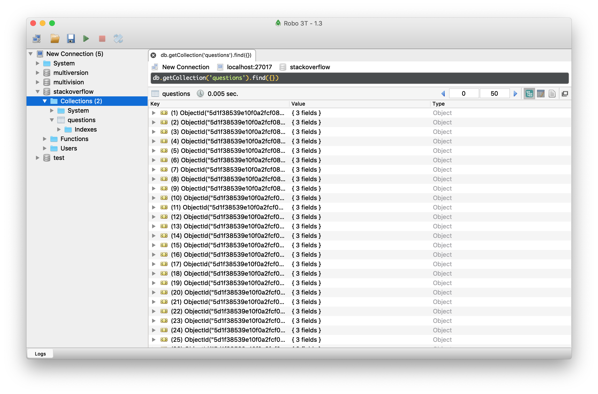

# Web Scraping with Scrapy and MongoDB test
A test project on scrapy, following the [scrapy tutorial](https://realpython.com/web-scraping-with-scrapy-and-mongodb/#store-the-data-in-mongodb).

Here we scrape the questions on Stackoverflow.

## Test it out:

* First create conda environment based on ``` environment.yaml```

* Then start start the mongodb data base with ```mongod```

* Then run ```scrapy crawl stack``` (new terminal window) from within the ```stack ```folder of the project.

Here is an image of the db result:


